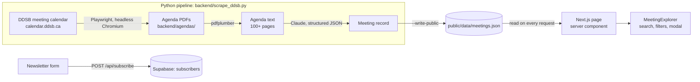

# DDSB CivicPulse

**DDSB trustee decisions, decoded.** CivicPulse turns 100+ page Durham District School Board
trustee meeting agendas into three-point summaries that students and parents in Ajax,
Pickering, Whitby, Oshawa and Uxbridge can read in a minute.

> CivicPulse is an independent project, not affiliated with or endorsed by the DDSB.
> `public/data/meetings.json` starts empty and is filled with real meetings by the pipeline
> (see [Automation](#automation-github-actions)). Until the first run, the site shows a
> "No meetings decoded yet" message.

## View the app locally

Requires Node.js 18.17+ (tested on Node 24).

```bash
npm install
npm run dev
```

Open <http://localhost:3000>. The front end reads `public/data/meetings.json`, so no Python or
API key is needed just to view the app.

### Newsletter sign-ups (Supabase)

Sign-ups are stored in a Supabase table. To enable them:

1. In the Supabase dashboard, open **SQL Editor**, paste `backend/schema.sql` and run it. It
   creates `subscribers` (`id`, `email` unique, `created_at`) with Row Level Security on and no
   policies, so the public key can't read the list.
2. Copy `.env.example` to `.env.local` and set `SUPABASE_SERVICE_ROLE_KEY` to the project's
   **secret** key (Project Settings → API Keys). It's used only on the server. Never commit it,
   and never give it a `NEXT_PUBLIC_` prefix.
3. For the deployed site, add the same two variables in Vercel (Project → Settings →
   Environment Variables), then redeploy.

Without these variables the form still works but replies that sign-ups aren't open yet.

| Script | What it does |
| --- | --- |
| `npm run dev` | Development server with hot reload on port 3000 |
| `npm run build` / `npm start` | Production build and server |
| `npm run typecheck` | TypeScript check |

### What you can do in the app

- **Search** every summary (titles, bullets, impact, policy text), instantly, in the browser.
- **Filter** by town (Ajax, Pickering, Whitby, Oshawa, Uxbridge) and category (Boundary Review,
  Transport, Policy, Budget).
- **Open a card** for the full breakdown: executive summary, what it means for students and
  parents, policy changes, and a link to the original agenda. Each breakdown has a shareable URL
  (`/?meeting=<id>`).
- **Subscribe** to meeting alerts. The form posts to `/api/subscribe`, which validates the email
  and saves it to the Supabase `subscribers` table.

## How it fits together



The JSON file is the contract between the two halves. The Python pipeline writes records in
exactly the shape the front end reads (`lib/types.ts` → `Meeting`). An illustrative record:

```jsonc
{
  "id": "2026-09-08-committee-of-the-whole-standing",   // date + committee: one record per meeting
  "meetingDate": "2026-09-08",
  "committeeName": "Committee of the Whole - Standing",
  "title": "Draft boundaries set for the new Seaton elementary school",
  "urgencyScore": 5,                       // 1 (FYI) … 5 (act now); 4–5 red, 3 amber, 1–2 green
  "townsAffected": ["Pickering", "Ajax"],
  "category": "Boundary Review",           // Boundary Review | Transport | Policy | Budget
  "executiveSummary": ["…", "…", "…"],     // exactly 3 bullets
  "studentParentImpact": "…",
  "policyChanges": "…",
  "originalPdfUrl": "https://www.ddsb.ca/about-ddsb/board-of-trustees/board-meetings/"
}
```

Because `app/page.tsx` re-reads `meetings.json` on each request, a fresh pipeline run shows up on
the next page load with no rebuild.

## The Python backend

`backend/scrape_ddsb.py` runs in five steps:

1. **Discover**: opens the DDSB meeting calendar (`calendar.ddsb.ca/meetings`) in headless
   Chromium with Playwright and waits for the meeting table to render. For each row it reads the
   date, the meeting name and the link in the **Agenda** column (found by its header text). That
   link is the agenda PDF itself. `--months-back N` follows the calendar's "‹" link to include
   earlier months.
2. **Download**: saves each PDF to `backend/agendas/` through the same browser context, named like
   `2026-09-09-committee-of-the-whole-standing-1b62b947.pdf`. Files already on disk are reused.
   The suffix is the calendar's document id, so a reposted, revised agenda is fetched again.
3. **Extract**: pulls the text with `pdfplumber`, keeping `--- page N ---` markers.
   `simulate_pdfplumber_extraction()` is the dummy stand-in used by `--offline`.
4. **Summarize**: `summarize_with_claude()` sends the full agenda text to Claude
   (`claude-opus-5`) with a JSON schema, so the reply always parses into the record shape.
   `summarize_dummy()` is a free keyword-based placeholder with the same output shape.
5. **Publish**: writes `backend/output/meetings.generated.json`; with `--write-public` it
   upserts the records (by `id`) into `public/data/meetings.json`.

### Set up

Python 3.10 or newer (the `anthropic` SDK requires it).

```bash
python -m venv .venv
.venv\Scripts\activate        # macOS/Linux: source .venv/bin/activate
pip install -r backend/requirements.txt
python -m playwright install chromium
```

The last command is a one-time download of the headless Chromium build Playwright drives.

### Run

```bash
# No network, no browser, no API key: simulated agenda + dummy summarizer
python backend/scrape_ddsb.py --offline

# Live calendar: download the latest agendas to backend/agendas/ (dummy summaries)
python backend/scrape_ddsb.py --limit 3

# Go back three months, summarize with Claude, and publish to the app
python backend/scrape_ddsb.py --months-back 3 --limit 10 --summarizer claude --write-public

# Re-summarize a PDF that's already downloaded
python backend/scrape_ddsb.py --pdf backend/agendas/<file>.pdf --summarizer claude
```

| Flag | Default | Meaning |
| --- | --- | --- |
| `--offline` | off | Skip the browser and network; use the simulated agenda text |
| `--pdf FILE` | none | Summarize local PDF(s) instead of scraping (repeatable) |
| `--summarizer {dummy,claude}` | `dummy` | `claude` calls the Claude API (costs money) |
| `--limit N` | `3` | Max agendas to process from the calendar, newest first |
| `--months-back N` | `1` | Start the calendar listing N months before the current month |
| `--headed` | off | Show the browser window (useful when the calendar's markup changes) |
| `--out PATH` | `backend/output/meetings.generated.json` | Where results are written |
| `--write-public` | off | Upsert results into `public/data/meetings.json`, skipping agendas already published |
| `--refresh` | off | With `--write-public`, re-summarize agendas even if they're already published |

Each meeting has one record, keyed by date and committee. Re-running the pipeline updates that
record rather than adding a duplicate. When the board reposts a revised agenda, its new
document link triggers a fresh summary.

The calendar lists every upcoming meeting, but agendas are only posted a few days before each
one, so most rows have no Agenda link yet and are skipped.

The dummy summarizer only reads the agenda's order of business: it lists the first three
substantive items and guesses a category. Use `--summarizer claude` for real summaries.

**Claude credentials.** `--summarizer claude` uses the SDK's default credential lookup: set
`ANTHROPIC_API_KEY` in `backend/.env` (copy `backend/.env.example`), or sign in once with
`ant auth login`. Requests stream (long agendas don't time out) and opt into the API's
server-side fallback, so a declined request is retried on another model automatically.

### If the calendar changes

The scraper depends on three things in the calendar's markup, all in `discover_agendas()` and
`READ_MEETING_ROWS_JS`:

- meeting rows with `td[headers="c1"]` (date) and `td[headers="c2"]` (meeting link)
- an attachment column whose header reads **Agenda**
- a "‹" link for the previous month

If a run reports that the calendar didn't render, or finds no agendas where you can see some
in a browser, re-run with `--headed` to watch what the page does and update those selectors.

### Automation (GitHub Actions)

`.github/workflows/scrape.yml` runs the pipeline every Monday at 11:00 UTC (6:00 AM EST,
7:00 AM during daylight time), and on demand from the repo's **Actions** tab (**Run workflow**).
It installs Python 3.11, the requirements and Chromium, then runs:

```bash
python backend/scrape_ddsb.py --months-back 1 --limit 10 --summarizer dummy --write-public
```

This uses the free built-in summarizer, so no API key or secret is needed. Each published
meeting shows its date, committee and first three agenda items, with a keyword guess at category,
towns and urgency; the student/parent explanation points readers to the original agenda.

If `public/data/meetings.json` changed, it commits the file as `github-actions[bot]` and pushes
it. The downloaded PDFs are kept as a run artifact for 14 days.

Before the first run:

1. Check that **Settings → Actions → General → Workflow permissions** allows read and write
   access, or the push is rejected.
2. Connect the Vercel project to the repository (Vercel → Project → Settings → Git), so each
   bot commit redeploys the site.

To switch to Claude summaries later, add an `ANTHROPIC_API_KEY` repository secret, pass it to
the scrape step as an environment variable, and change `--summarizer dummy` to `claude`. Meetings
already published by the built-in summarizer are kept as they are until you run once with `--refresh`.

## Project structure

```
app/
  layout.tsx              fonts (Newsreader, Atkinson Hyperlegible, IBM Plex Mono), metadata
  page.tsx                header, hero, feed, newsletter band, footer (server component)
  globals.css             Tailwind layers, dialog and bottom-sheet styles, reduced-motion
  api/subscribe/route.ts  validates emails and inserts them into Supabase
components/
  MeetingExplorer.tsx     search, town/category chips, results count, feed, empty state
  MeetingCard.tsx         feed card
  MeetingDialog.tsx       full breakdown (native <dialog>; bottom sheet on phones)
  Badges.tsx              date, urgency (color + icon + words), town and category labels
  HeroIllustration.tsx    agenda-page graphic
  NewsletterForm.tsx      email sign-up with loading, success and error states
lib/                      types, date/urgency helpers, meetings.json loader
middleware.ts             returns 404 for the old /data/subscribers.json path
public/data/              meetings.json (written by the pipeline)
backend/                  scrape_ddsb.py, requirements.txt, .env.example
  agendas/                downloaded agenda PDFs (git-ignored)
design/                   Claude Design canvas source (.dc.html artboards)
```

## Notes

- **Subscriber privacy.** Emails are stored in Supabase behind Row Level Security, and only the
  server holds the secret key. The API gives the same response for new and existing emails, so
  it can't be used to check who has signed up.
- **Not yet built:** sending the emails, rate limiting the sign-up endpoint, and an unsubscribe flow.
- **Accessibility.** WCAG AA contrast, visible focus rings, keyboard-operable filters and
  dialog, 44px touch targets on phones, and `prefers-reduced-motion` support.
