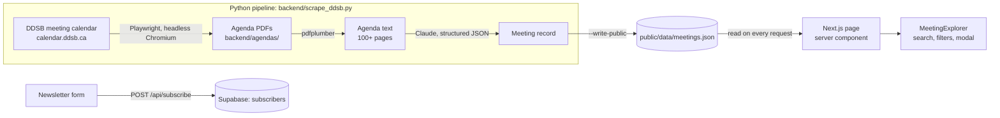

# DDSB CivicPulse

**DDSB trustee decisions, decoded.** CivicPulse turns 100+ page Durham District School Board
trustee meeting agendas into three-point summaries that students and parents in Ajax,
Pickering, Whitby, Oshawa and Uxbridge can read in a minute.

> CivicPulse is an independent project, not affiliated with or endorsed by the DDSB.
> `public/data/meetings.json` starts empty and is filled with real meetings by the pipeline
> (see [Automation](#automation-github-actions)). Until the first run, the site shows a
> "No meetings decoded yet" message.

## View the app locally

Requires Node.js 18.17+ (tested on Node 24).

```bash
npm install
npm run dev
```

Open <http://localhost:3000>. The front end reads `public/data/meetings.json`, so no Python or
API key is needed just to view the app.

### Newsletter sign-ups (Supabase)

Sign-ups are stored in a Supabase table. To enable them:

1. In the Supabase dashboard, open **SQL Editor**, paste `backend/schema.sql` and run it. It
   creates `subscribers` (`id`, `email` unique, `created_at`) with Row Level Security on and no
   policies, so the public key can't read the list.
2. Copy `.env.example` to `.env.local` and set `SUPABASE_SERVICE_ROLE_KEY` to the project's
   **secret** key (Project Settings → API Keys). It's used only on the server. Never commit it,
   and never give it a `NEXT_PUBLIC_` prefix.
3. For the deployed site, add the same two variables in Vercel (Project → Settings →
   Environment Variables), then redeploy.

Without these variables the form still works but replies that sign-ups aren't open yet.

### Welcome emails and unsubscribing

Each new subscriber gets a welcome email: what CivicPulse will send (one short email after each
trustee meeting: the decisions, towns affected, deadlines to have your say, and the original
agenda), how often, and an unsubscribe link. Re-submitting an address that's already on the list
doesn't send a second one. Emails go out over SMTP, so any provider works. Set these in
`.env.local` and in Vercel, as plain values:

| Variable | Gmail | Resend |
| --- | --- | --- |
| `SMTP_HOST` | `smtp.gmail.com` | `smtp.resend.com` |
| `SMTP_PORT` | `465` | `465` |
| `SMTP_USER` | your Gmail address | `resend` |
| `SMTP_PASS` | a 16-character [app password](https://myaccount.google.com/apppasswords) (needs 2-Step Verification) | your `re_...` API key |
| `EMAIL_FROM` | `CivicPulse <you@gmail.com>` | `CivicPulse <alerts@yourdomain>` (a domain verified in Resend) |

Also set `SITE_URL=https://ddsb-civicpulse.vercel.app` so email links always point at the public
site. If SMTP isn't configured, sign-ups still save and the email is skipped, with a log line.

Every email carries an unsubscribe link to `/unsubscribe`, a page with a confirm button, so link
scanners that open URLs can't unsubscribe anyone. It also sets `List-Unsubscribe` and
`List-Unsubscribe-Post` headers, so Gmail and Apple Mail show their built-in one-click
unsubscribe. Links are signed per subscriber (id + HMAC of the email). They carry no email
address, and they stop working if the Supabase secret key is rotated, unless `UNSUBSCRIBE_SECRET`
is set. Unsubscribing deletes the row.

### Meeting summary emails (digest)

When new meetings reach the site, subscribers get one email that covers all of them, most urgent
first: date, committee, title, urgency, towns, the three key points, and links to the full
breakdown and the original agenda. Nothing is sent on days without new meetings.

How it runs:

1. The daily GitHub workflow (11:00 UTC) adds new meetings to `meetings.json`, and Vercel redeploys.
2. Vercel Cron (`vercel.json`) calls `/api/digest` every day at 14:00 UTC with
   `Authorization: Bearer $CRON_SECRET`.
3. The route picks meetings from the last 45 days that aren't in the Supabase `digest_log` table.
   It claims them there, emails each subscriber separately (with their own unsubscribe link),
   then records how many went out. The claim means a meeting is never emailed twice. If every
   send fails (for example, a bad SMTP password), the claim is released and the next run retries.

Setup: run `backend/schema.sql` in Supabase (it creates `digest_log`), and set `CRON_SECRET` to a
long random string in `.env.local` and in Vercel.

Trigger or test it by hand with the same header:

```bash
curl -H "Authorization: Bearer $CRON_SECRET" "https://ddsb-civicpulse.vercel.app/api/digest?dryRun=1"
```

`?dryRun=1` reports which meetings would go out and to how many subscribers, without sending.
`?previewTo=you@example.com` sends the digest to that one address without marking anything as
sent. A call with no query string sends the real digest.

Gmail allows roughly 500 emails a day, and a run stops sending after about 50 seconds (Vercel's
Hobby time limit is 60), which is enough for about a hundred subscribers. Past that, switch to a
bulk email provider.

| Script | What it does |
| --- | --- |
| `npm run dev` | Development server with hot reload on port 3000 |
| `npm run build` / `npm start` | Production build and server |
| `npm run typecheck` | TypeScript check |

### What you can do in the app

- **Search** every summary (titles, bullets, impact, policy text), instantly, in the browser.
- **Filter** by town (Ajax, Pickering, Whitby, Oshawa, Uxbridge) and category (Boundary Review,
  Transport, Policy, Budget).
- **Open a card** for the full breakdown: executive summary, what it means for students and
  parents, policy changes, and a link to the original agenda. Each breakdown has a shareable URL
  (`/?meeting=<id>`).
- **Subscribe** to meeting alerts. The form posts to `/api/subscribe`, which validates the email
  and saves it to the Supabase `subscribers` table.

## How it fits together



The JSON file is the contract between the two halves. The Python pipeline writes records in
exactly the shape the front end reads (`lib/types.ts` → `Meeting`). An illustrative record:

```jsonc
{
  "id": "2026-09-08-committee-of-the-whole-standing",   // date + committee: one record per meeting
  "meetingDate": "2026-09-08",
  "committeeName": "Committee of the Whole - Standing",
  "title": "Draft boundaries set for the new Seaton elementary school",
  "urgencyScore": 5,                       // 1 (FYI) … 5 (act now); 4–5 red, 3 amber, 1–2 green
  "townsAffected": ["Pickering", "Ajax"],
  "category": "Boundary Review",           // Boundary Review | Transport | Policy | Budget
  "executiveSummary": ["…", "…", "…"],     // exactly 3 bullets
  "studentParentImpact": "…",
  "policyChanges": "…",
  "originalPdfUrl": "https://www.ddsb.ca/about-ddsb/board-of-trustees/board-meetings/"
}
```

Because `app/page.tsx` re-reads `meetings.json` on each request, a fresh pipeline run shows up on
the next page load with no rebuild.

## The Python backend

`backend/scrape_ddsb.py` runs in five steps:

1. **Discover**: opens the DDSB meeting calendar (`calendar.ddsb.ca/meetings`) in headless
   Chromium with Playwright and waits for the meeting table to render. For each row it reads the
   date, the meeting name and the link in the **Agenda** column (found by its header text). That
   link is the agenda PDF itself. `--months-back N` follows the calendar's "‹" link to include
   earlier months.
2. **Download**: saves each PDF to `backend/agendas/` through the same browser context, named like
   `2026-09-09-committee-of-the-whole-standing-1b62b947.pdf`. Files already on disk are reused.
   The suffix is the calendar's document id, so a reposted, revised agenda is fetched again.
3. **Extract**: pulls the text with `pdfplumber`, keeping `--- page N ---` markers.
   `simulate_pdfplumber_extraction()` is the dummy stand-in used by `--offline`.
4. **Summarize**: one of three summarizers, all producing the same record shape:
   `summarize_with_gemini()` (Google Gemini, free tier; what the daily workflow uses),
   `summarize_with_claude()` (Claude, paid), or `summarize_dummy()` (built-in keyword parser,
   free and offline). The AI summarizers share one prompt: plain language, no facts beyond the
   agenda, and past tense for meetings that have already happened, since an agenda never says
   what was decided.
5. **Publish**: writes `backend/output/meetings.generated.json`; with `--write-public` it
   upserts the records (by `id`) into `public/data/meetings.json`.

### Set up

Python 3.10 or newer (the `anthropic` SDK requires it).

```bash
python -m venv .venv
.venv\Scripts\activate        # macOS/Linux: source .venv/bin/activate
pip install -r backend/requirements.txt
python -m playwright install chromium
```

The last command is a one-time download of the headless Chromium build Playwright drives.

### Run

```bash
# No network, no browser, no API key: simulated agenda + dummy summarizer
python backend/scrape_ddsb.py --offline

# Live calendar: download the latest agendas to backend/agendas/ (dummy summaries)
python backend/scrape_ddsb.py --limit 3

# Go back three months, summarize with Claude, and publish to the app
python backend/scrape_ddsb.py --months-back 3 --limit 10 --summarizer claude --write-public

# Re-summarize a PDF that's already downloaded
python backend/scrape_ddsb.py --pdf backend/agendas/<file>.pdf --summarizer claude
```

| Flag | Default | Meaning |
| --- | --- | --- |
| `--offline` | off | Skip the browser and network; use the simulated agenda text |
| `--pdf FILE` | none | Summarize local PDF(s) instead of scraping (repeatable) |
| `--summarizer {dummy,gemini,claude}` | `dummy` | `gemini`: free tier, falls back to built-in; `claude`: paid |
| `--limit N` | `3` | Max agendas to process from the calendar, newest first |
| `--months-back N` | `1` | Start the calendar listing N months before the current month |
| `--headed` | off | Show the browser window (useful when the calendar's markup changes) |
| `--out PATH` | `backend/output/meetings.generated.json` | Where results are written |
| `--write-public` | off | Upsert results into `public/data/meetings.json`, skipping agendas already published |
| `--refresh` | off | With `--write-public`, re-summarize agendas even if they're already published |

Each meeting has one record, keyed by date and committee. Re-running the pipeline updates that
record rather than adding a duplicate. When the board reposts a revised agenda, its new
document link triggers a fresh summary.

The calendar lists every upcoming meeting, but agendas are only posted a few days before each
one, so most rows have no Agenda link yet and are skipped.

The built-in summarizer only reads the agenda's order of business: it lists up to three
substantive items and guesses a category. The AI summarizers write real summaries.

**Gemini.** Put a Google AI Studio key in `backend/.env` as `GEMINI_API_KEY` (and in the
`GEMINI_API_KEY` GitHub secret for the workflow). It tries `gemini-3.6-flash`, then
`gemini-3.5-flash`, then `gemini-3.5-flash-lite` (override with `GEMINI_MODELS`). Each model
has its own free-tier quota. Per-minute rate limits are waited out and retried. When every
model is out of quota or unavailable, that meeting gets the built-in summary instead, and the
next run upgrades it (records carry a `summarySource` field). Nothing is charged unless you add
billing to the Google project. On the free tier, Google may use requests to improve its products;
only public agenda text is sent.

**Claude credentials.** `--summarizer claude` uses the SDK's default credential lookup: set
`ANTHROPIC_API_KEY` in `backend/.env` (copy `backend/.env.example`), or sign in once with
`ant auth login`. Requests stream (long agendas don't time out) and opt into the API's
server-side fallback, so a declined request is retried on another model automatically.

### If the calendar changes

The scraper depends on three things in the calendar's markup, all in `discover_agendas()` and
`READ_MEETING_ROWS_JS`:

- meeting rows with `td[headers="c1"]` (date) and `td[headers="c2"]` (meeting link)
- an attachment column whose header reads **Agenda**
- a "‹" link for the previous month

If a run reports that the calendar didn't render, or finds no agendas where you can see some
in a browser, re-run with `--headed` to watch what the page does and update those selectors.

### Automation (GitHub Actions)

`.github/workflows/scrape.yml` runs the pipeline every day at 11:00 UTC (6:00 AM EST, 7:00 AM
during daylight time), and on demand from the repo's **Actions** tab (**Run workflow**). A newly
posted agenda is on the site within a day; on days without one, nothing changes. It installs
Python 3.11, the requirements and Chromium, then runs:

```bash
python backend/scrape_ddsb.py --months-back 1 --limit 10 --summarizer gemini --write-public
```

It summarizes with Gemini using the `GEMINI_API_KEY` repository secret. A **Check Gemini key**
step runs first. If the key is missing or rejected, that step turns red with a warning, but the
run continues. Meetings then get the built-in summary, the run shows a "Gemini fallback" warning,
and a later run upgrades them. When you start a run by hand, tick **refresh** to re-summarize
meetings that are already on the site, for example after changing the prompt.

If `public/data/meetings.json` changed, it commits the file as `github-actions[bot]` and pushes
it. The downloaded PDFs are kept as a run artifact for 14 days.

Before the first run:

1. Add the `GEMINI_API_KEY` secret under **Settings → Secrets and variables → Actions**.
2. Check that **Settings → Actions → General → Workflow permissions** allows read and write
   access, or the push is rejected.
3. Connect the Vercel project to the repository (Vercel → Project → Settings → Git), so each
   bot commit redeploys the site.

To use Claude instead, add an `ANTHROPIC_API_KEY` repository secret, pass it to the scrape step
as an environment variable, and change `--summarizer gemini` to `claude`.

GitHub pauses scheduled workflows in public repos after 60 days without repository activity. The
bot's commits count as activity, but a long break with no new meetings (like summer) can pause
it. If that happens, re-enable it from the **Actions** tab.

## Project structure

```
app/
  layout.tsx              fonts (Newsreader, Atkinson Hyperlegible, IBM Plex Mono), metadata
  page.tsx                header, hero, feed, newsletter band, footer (server component)
  globals.css             Tailwind layers, dialog and bottom-sheet styles, reduced-motion
  api/subscribe/route.ts  validates emails, inserts them into Supabase, sends the welcome email
  api/unsubscribe/route.ts  verifies a signed link and removes the subscriber (POST only)
  api/digest/route.ts     daily cron: emails subscribers a digest of newly decoded meetings
  unsubscribe/page.tsx    unsubscribe confirmation page
components/
  MeetingExplorer.tsx     search, town/category chips, results count, feed, empty state
  MeetingCard.tsx         feed card
  MeetingDialog.tsx       full breakdown (native <dialog>; bottom sheet on phones)
  Badges.tsx              date, urgency (color + icon + words), town and category labels
  HeroIllustration.tsx    agenda-page graphic
  NewsletterForm.tsx      email sign-up with loading, success and error states
lib/                      types, date/urgency helpers, meetings.json loader,
                          Supabase admin client, welcome email (SMTP), signed unsubscribe links
middleware.ts             returns 404 for the old /data/subscribers.json path
public/data/              meetings.json (written by the pipeline)
backend/                  scrape_ddsb.py, requirements.txt, .env.example
  agendas/                downloaded agenda PDFs (git-ignored)
design/                   Claude Design canvas source (.dc.html artboards)
```

## Notes

- **Subscriber privacy.** Emails are stored in Supabase behind Row Level Security, and only the
  server holds the secret key. The API gives the same response for new and existing emails, so
  it can't be used to check who has signed up.
- **Not yet built:** double opt-in confirmation, per-town email preferences, and rate limiting on
  the sign-up endpoint.
- **Accessibility.** WCAG AA contrast, visible focus rings, keyboard-operable filters and
  dialog, 44px touch targets on phones, and `prefers-reduced-motion` support.
